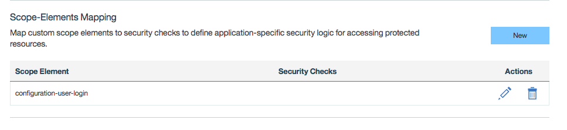
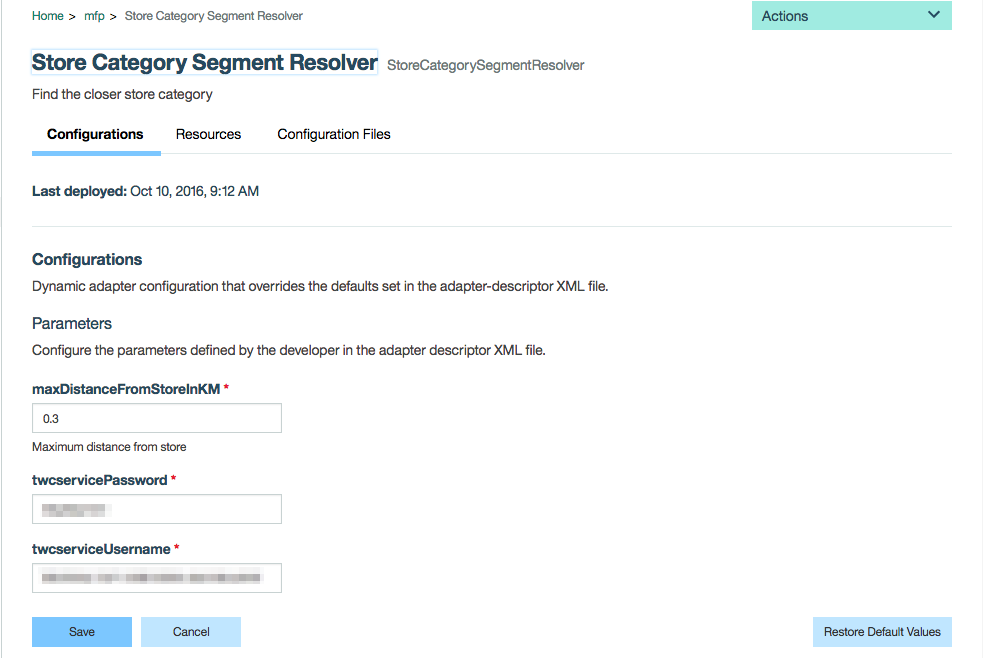
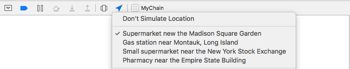
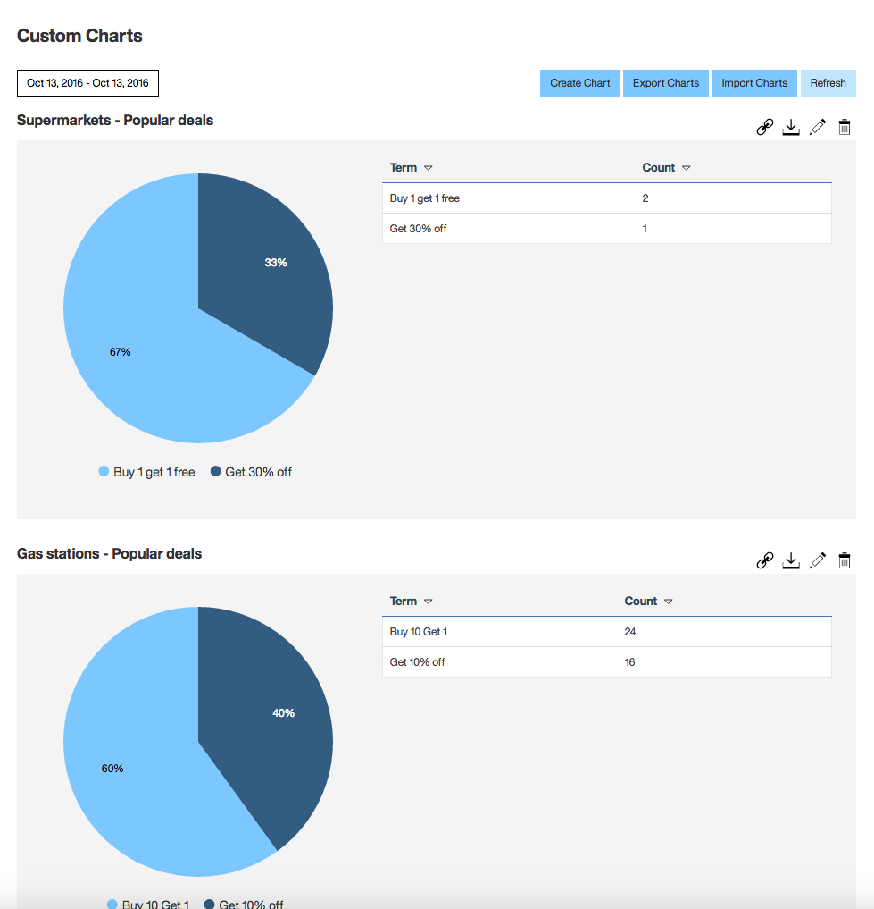

# Real-time Personalization with Live Update

The purpose of the sample is to show how you can achieve Real-time Personalization in your app leverging the MobileFirst Foundation Live Update feature.

The sample allows customers to get offers (The UX is like in the [Tinder] (https://en.wikipedia.org/wiki/Tinder_(app) app) app, based on their current location and the current weather conditions. It simulates an app of a credit card company that has partnerships with a variety of business. In this sample there are 4 types of businesses:

* supermarket
* small supermarket
* pharmacy
* gas station

Each time a customer is near one of the businesses above, he gets deals relevant to that location.  In addition, depending on weather at that location (using the `Weather Company Data` service), the customer will gets deals relevant for the current weather. In the sample the `gas-station` has additional segment `gas-station-rainy,` so that if it is raining (detected with the `Weather Company Data`), the gas station will offer an umbrella deal.

### Prerequisites
1. [Installed Git](https://git-scm.com/book/en/v2/Getting-Started-Installing-Git)
2. Pre-installed IBM MobileFirst Platform [development environment](https://mobilefirstplatform.ibmcloud.com/tutorials/en/foundation/8.0/setting-up-your-development-environment/).
3. Understanding the IBM MobileFirst Platform [Java Adapters](https://mobilefirstplatform.ibmcloud.com/tutorials/en/foundation/8.0/adapters/java-adapters/).
4. Understanding the IBM MobileFirst Platform [Live Update](https://mobilefirstplatform.ibmcloud.com/tutorials/en/foundation/8.0/using-the-mfpf-sdk/live-update/).

### Running the sample

- Clone this repository   

 ```bash
 $ git clone https://github.com/mfpdev/personalization-with-liveupdate
 ```

- Deploy the `MarketingAdapter` adapter
  * Build and deploy the adapter using maven:
    * From a **Command-line**, navigate to the **MarketingAdapter** project's root folder
    * Build using maven by executing `mvn clean install`
    * Deploy the adapter into your MobileFirst server by running `mvn adapter:deploy` (assure that your MobileFirst
  server connection parameters are updated in the **pom.xml** file)
- Deploy the `StoreCategorySegmentResolver` Adapter (same instructions as `MarketingAdapter`)

- Deploy the `Live Update Adapter` by following this  [link](https://mobilefirstplatform.ibmcloud.com/tutorials/en/foundation/8.0/using-the-mfpf-sdk/live-update/#adding-live-update-to-mobilefirst-server)

>Note: maven is just one way to build and deploy adapters, to learn more about adapters see the following [link](https://mobilefirstplatform.ibmcloud.com/tutorials/en/foundation/8.0/adapters/)

- Register the `MyChain` native iOS app
  * Register the application with [mfpdev CLI](https://mobilefirstplatform.ibmcloud.com/tutorials/en/foundation/8.0/using-the-mfpf-sdk/using-mobilefirst-cli-to-manage-mobilefirst-artifacts/):
    * From a **Command-line**, navigate to the **MyChain** project's root folder
    * Register the app by using by executing `mfpdev app register`

>Note: you can also register app using `MobileFirst Operations console` (Applications->new)

- Configure the `Live Update Settings`
  - Set the resolver adapter name:
    * From the [MobileFirst Operations console](http://localhost:9080/mfpconsole) go to **Adapters->Live Update Adapter** and set the **segmentResolverAdapterName** to be `StoreCategorySegmentResolver`
  - Import the Live Update schema:
    * The scheme to import is located in the file **schema.txt**
    * Import the schema by executing the following curl command:

      ```bash
      curl -X PUT -d @schema.txt --user admin:admin -H "Content-Type:application/json" http://localhost:9080/mfpadmin/management-apis/2.0/runtimes/mfp/admin-plugins/liveUpdateAdapter/com.github.mfpdev.sample.MyChain/schema
      ```
  - Import the Live Update segments:
    * The segments to import are located in the file **segments.txt**
    * Import the segments by executing the following script (save the script to file first):

      ```bash
      #!/bin/bash
      segments_number=$(python -c 'import json,sys;obj=json.load(sys.stdin);print len(obj["items"]);' < segments.txt)
      counter=0
      while [ $segments_number -gt $counter ]
      do
          segment=$(cat segments.txt | python -c 'import json,sys;obj=json.load(sys.stdin);data_str=json.dumps(obj["items"]['$counter']);print data_str;')
          echo $segment | curl -X POST -d @- --user admin:admin --header "Content-Type:application/json" http://localhost:9080/mfpadmin/management-apis/2.0/runtimes/mfp/admin-plugins/liveUpdateAdapter/com.github.mfpdev.sample.MyChain/segment
          ((counter++))
      done
      ```
>Note: if you are using windows you need to have a bash environment installed.

- Security configuration
  * From [MobileFirst Operations console](http://localhost:9080/mfpconsole) go to **Applications->CouponsApp->iOS->Security(Tab)**. In `Scope-Elements Mapping` map scope `configuration-user-login` to `empty` (default scope).  
  

- Create `Weather Company Data` service
  * In  [BlueMix](http://www.blumemix.com) create `Weather Company Data` service by following instructions from this [link](https://console.ng.bluemix.net/docs/services/Weather/index.html).  You will need the username and the password for next step.

- StoreCategorySegmentResolver configuration
  * From [MobileFirst Operations console](http://localhost:9080/mfpconsole) go to **Adapters->Coupons Adapter**. In `Configurations` set the `maxDistanceFromStoreInKM` value which is the geofence radius which let the resolver adapter decide which store the customer is close to. In addition set the `twcservicePassword` and the `twcserviceUsername` from the previous step.

    

- Change the location to see results in the app:
  * From XCode you can change the pre configured locations and see how it affects the application.

    


### Live Update configurations options

* Summary tables showing the options available for this application:

| Propery Name   |      Id      |  Description |
|:----------|:-------------|:------|
| App Background Color |  bgColor | Store type back ground color |
| Adapter Deals URL|  dealsAdapterURL | The radius in meters to be able pick a discount coupon |


### Using Analytics

  * After using the app for a while you can go to the [MobileFirst Analytics Console](http://localhost:9080/analytics/console/dashboard) and build your custom charts like the one below:
  

### External dependencies frameworks used in the app

* [Koloda](https://github.com/Yalantis/Koloda) - this frameworks let's build app with UX based on [Tinder](https://en.wikipedia.org/wiki/Tinder_(app)) app.

### Supported Levels
IBM MobileFirst Foundation 8.0

### License
Copyright 2016 IBM Corp.

Licensed under the Apache License, Version 2.0 (the "License");
you may not use this file except in compliance with the License.
You may obtain a copy of the License at

http://www.apache.org/licenses/LICENSE-2.0

Unless required by applicable law or agreed to in writing, software
distributed under the License is distributed on an "AS IS" BASIS,
WITHOUT WARRANTIES OR CONDITIONS OF ANY KIND, either express or implied.
See the License for the specific language governing permissions and
limitations under the License.
